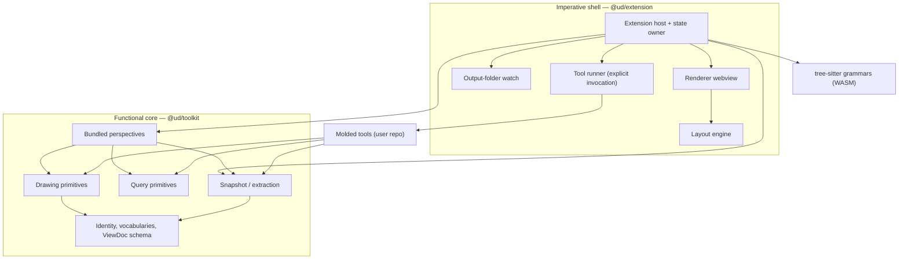
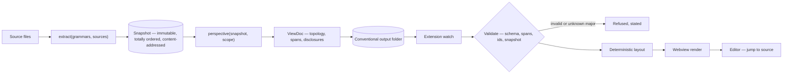

# Architecture Spine — unoriginally-deterministic

## Design Paradigm

**Functional core / imperative shell.**

The **core** is pure: extraction and every perspective are functions over immutable values — `extract(grammars, sources) → Snapshot`, `perspective(snapshot, scope) → ViewDoc`. No I/O, no clock, no ambient state, no editor. Grammars and source text arrive as *values*; the shell reads them.

The **shell** is the VS Code extension: file reading, grammar loading, the output-folder watch, webview messaging, editor jumps, layout, tool execution. The shell calls the core; the core never calls back.

This makes "same code, same picture" true by construction rather than by discipline, and makes a molded tool exactly one pure function — the narrowest job an assistant can be given, which is what PRD SM-2's odds rest on.

An arrow means *may depend on*; the reverse is forbidden.



## Build Phasing

The spine is committed in full; the **surface** ships in the order PRD §5.2 fixes, so the reliability gate (OQ-1) fires early and cheap. An AD is in force from the phase it first applies.

| Tier | Contains | Contract state |
| --- | --- | --- |
| **Gate slice** | COBOL extraction incl. copybook resolution + **data artifacts (files and tables)** · provenance-enforcing primitives · dependency map only · click-to-source · unparsed/unresolved rendering | **Frozen minimal** (AD-20) |
| **Phase A remainder** | Unit flowchart · view gallery | Frozen until OQ-1 resolves |
| **Phase B** | Sequence · reach tracer (bidirectional) · call-flow · trail history · provenance rail · Code-perspective sync · perspective registration (FR-10) | Contract may extend post-gate |
| **Phase C** *(post-v1)* | Change review — extraction diff across a PR's base and head, rendered in VS Code (see *Deferred*, and [ROADMAP.md](../../ROADMAP.md)) | Contract may extend post-gate |

## Invariants & Rules

### AD-1 — Purity boundary

- **Binds:** all core packages, all molded tools
- **Prevents:** hidden I/O or ambient state making two runs over identical source disagree
- **Rule:** nothing in `@ud/toolkit` performs I/O, reads a clock, reads env, or imports `vscode`. Grammar binaries and source text are **supplied as values by the shell**, never read by the core. Results leave as values.

### AD-2 — Node identity is a canonical typed URI, minted and canonicalized by the contract [ADOPTED]

- **Binds:** every producer of a node or an edge endpoint
- **Prevents:** two producers minting different ids for one entity — which returns a *partial* inbound-reach answer that renders as complete
- **Rule:** ids are `<lang>:<kind>/<canonical-name>`, produced only by the toolkit's minter. The minter — not the caller — owns canonicalization, and each language profile supplies its rules: case folding (COBOL identifiers fold to upper), qualification (an unqualified SQL table resolves against the declared default schema; the qualified form is the identity), and logical-vs-physical resolution (a file's identity is its logical name; the physical assignment is an attribute). Canonicalization is covered by AD-14 golden files. Ids are re-validated at the render boundary alongside spans (AD-4).

### AD-3 — One snapshot owner; total order defined; content-addressed

- **Binds:** extraction, all perspectives
- **Prevents:** per-tool extraction diverging; iteration-order nondeterminism reaching layout; two implementers each claiming a different "canonical" order
- **Rule:** one extraction service produces an immutable `Snapshot`. **The total order is:** nodes by id (byte-wise ascending); edges by `(source id, kind, target id)`; spans by `(canonical path, start offset)`. Paths canonicalize to workspace-relative POSIX. Snapshot identity is a content hash over **file contents** (not mtimes), canonical paths, grammar+WASM-build versions, and extraction version. Staleness is hash comparison, never timestamps.

### AD-4 — Provenance enforced at both layers

- **Binds:** drawing primitives, ViewDoc validation
- **Prevents:** FR-4 being bypassed by hand-written or foreign JSON that never called the library
- **Rule:** drawing primitives require a source span in the signature — `draw.node(span, …)`, `draw.edge(span, …)` — so a call without one does not type-check and emits nothing; **and** ViewDoc is schema-validated at the render boundary, where an element with a missing span, a malformed id, or a span that does not resolve against the named snapshot is rejected regardless of origin.

### AD-5 — ViewDoc is the versioned exchange contract, with defined unknown-version behaviour

- **Binds:** all producers, the renderer
- **Prevents:** the renderer needing to know its producer; a version skew failing silently
- **Rule:** producers emit ViewDoc; the renderer is blind to which produced it. The schema carries an explicit version under semver. A ViewDoc with a **newer minor** version renders with unknown fields ignored; a **newer major** version is refused with a stated reason, never partially rendered; an **older supported** version renders. Refusal is a visible state, not a silent empty canvas.

### AD-6 — Producers emit topology only

- **Binds:** bundled perspectives, molded tools
- **Prevents:** two tools emitting differently-shaped documents for the same job; contract growth before the gate
- **Rule:** a ViewDoc carries nodes, edges, spans, kinds and disclosures (AD-22) — never coordinates. Layout is applied downstream. No producer imports or calls a layout engine.

### AD-7 — Layout is a pure function of its input

- **Binds:** renderer, layout engine selection, release process
- **Prevents:** identical code producing differently-arranged pictures, falsifying the determinism claim in front of the user's own eyes
- **Rule:** layout consumes canonically-ordered input (AD-3) and must be **configured so its output is a pure function of that input** — any engine option that introduces nondeterminism (a random seed, a time-derived value, a wall-clock iteration budget) is pinned to a deterministic value or the engine is disqualified. The engine and its version are pinned and recorded on the rendered artifact. Determinism is claimed **per layout selection**: the user-facing layout toggle chooses among layouts, each individually reproducible.

### AD-8 — The toolkit has zero VS Code dependency

- **Binds:** `@ud/toolkit` and everything it exports
- **Prevents:** molded tools becoming extension plugins; the core becoming untestable outside an extension host
- **Rule:** `@ud/toolkit` runs on plain Node and never imports `vscode`. A molded tool is a standalone Node module, not a plugin. No primitive reaches into the editor.

### AD-9 — Embedded constructs are typed by the profile's grammar

- **Binds:** every language profile whose grammar embeds another language
- **Prevents:** each profile inventing its own embedded-language handling; data lineage silently omitting SQL-touched tables
- **Rule:** where the profile's grammar types an embedded construct directly, extraction consumes those typed nodes — no second parser. For COBOL this is the case: `EXEC SQL` and `EXEC CICS` parse to typed nodes with named fields, including colon-prefixed host variables, so table lineage is single-stage. Language injection remains the fallback for genuinely opaque embedded regions, and contributes *through* the host profile (AD-21), never alongside it. Either way, a region that cannot be read becomes an unparsed honest state (AD-10), never a silent omission.

### AD-10 — Element-level honest states are a closed set owned by extraction [ADOPTED]

- **Binds:** extraction, all perspectives, the renderer
- **Prevents:** perspectives inventing private ways to signal doubt, so a view's trustworthiness varies by which tool drew it
- **Rule:** exactly four element-level states exist — **unparsed region** (parse failed), **unresolved target** (parse succeeded, destination not statically knowable), **unresolvable inclusion** (referenced source not locatable), **out-of-snapshot reference** (target statically named but absent from the extracted set). Extraction assigns them; perspectives render but never invent or suppress them. Every one still carries a span (its reference site), so AD-4 holds. View-level statements are AD-22's, not these.
- **Propagation:** the four are complete for *one* snapshot. Any operation comparing two snapshots must carry them across and may **never convert a state difference into a topology difference** — an element whose state differs between sides is *not comparable*, never added, removed or changed. A fresh view reporting deletion because one side failed to parse is a worse failure than any stale view, and at the clean rates in Deferred it is the common case, not the corner.

### AD-11 — One exchange convention; cache is not output

- **Binds:** bundled perspectives, molded tools, extension
- **Prevents:** producers writing to divergent locations; a stale cache being trusted as evidence
- **Rule:** every producer — bundled or molded — writes ViewDocs to one conventional workspace-relative output folder, which the extension watches; this is the only transport. The snapshot cache lives elsewhere. **Both are derived artifacts**: git-ignored by default, reconstructible by re-derivation, prunable without loss, and evidence of nothing on their own (AD-25).

### AD-12 — No implicit execution of repo code

- **Binds:** extension host, tool runner
- **Prevents:** navigation silently executing arbitrary code from the workspace
- **Rule:** the extension runs a molded tool **only on explicit user action** — gallery launch, drill, re-run — never on load, watch, or in the background. Given explicit invocation, molded views reach full parity with bundled ones: the renderer stays blind to producer, and the starter/molded distinction remains about where source lives and who owns it, never about how it renders.

### AD-13 — Distribution: one library, two consumers

- **Binds:** packaging, molded tools
- **Prevents:** molded tools depending on the toolkit project's survival (FR-6)
- **Rule:** the toolkit ships as a published npm package that molded tools import as an ordinary versioned dependency; the extension bundles the same package. No molded tool resolves primitives from the installed extension, and no toolkit-hosted registry or marketplace call is required for one to execute.

### AD-14 — Determinism is verified as a release gate

- **Binds:** CI, release process
- **Prevents:** the determinism claim decaying into an aspiration
- **Rule:** a committed fixture corpus yields expected Snapshot hash, expected ViewDoc, **and** expected laid-out output, byte-compared in CI. Drift in grammar version, WASM build, canonicalization, ordering, or layout engine fails the build. Canonicalization cases (case folding, qualification, logical-vs-physical) are fixtures in their own right. The claim ships only while the gate is green.

### AD-15 — Inclusion-derived identity anchors at the definition site

- **Binds:** extraction, AD-2 minter, all perspectives
- **Prevents:** the dependency map keying a copybook paragraph on its expansion site while the reach tracer keys it on its definition — node sets that cannot join, and silent FR-8 trail-restore failure
- **Rule:** an element defined in an included source has **one** identity, anchored at its definition site. Expansion is an *attribute* (which program included it, at which site), never part of the id. Both anchors travel with the element for provenance (PRD FR-1); only the definition anchor determines identity.

### AD-16 — The node-kind vocabulary is closed and model-owned

- **Binds:** all producers, renderer, legend
- **Prevents:** two producers classifying the same construct differently, and the legend having no fixed set to render
- **Rule:** node kinds are an enumeration in `toolkit/model`, each declaring its grain and whether it is a leaf. v1: `program`, `included-source`, `file`, `table` (system, leaf for `file`/`table`); `callable` (component); `block` (unit). A producer may not introduce a kind; adding one is a model change under AD-5 semver.

### AD-17 — The edge-kind vocabulary is closed, model-owned, and semantically typed

- **Binds:** all producers, reach queries, legend, renderer
- **Prevents:** one perspective emitting `static-reference` where another emits `read`/`write`/`invoke` — breaking cross-tool composition, the legend, the non-colour-cue commitment, and the `write`-typed query that answers "what writes to this table"
- **Rule:** edge kinds are an enumeration in `toolkit/model`, each carrying its direction semantics and whether it is data access. v1: `invoke`, `include`, `read`, `write`. Reach direction (AD-2 inbound/outbound) is computed from edge direction, never re-encoded per perspective. Post-gate extension is namespaced, never a redefinition.

### AD-18 — Scope and perspective are minted values with canonical serializations

- **Binds:** perspectives, extension state, FR-8 trail
- **Prevents:** trail restore comparing scopes structurally in one place and by reference in another, so "the same step" is undecidable
- **Rule:** `ScopeId` and `PerspectiveId` are minted values with canonical string forms and value equality. A trail step is `(SnapshotRef, ScopeId, PerspectiveId, selection)` — all four, all comparable. A ViewDoc names the `SnapshotRef` it was derived from, and the renderer rejects one whose snapshot it cannot resolve (AD-25).
- **`SnapshotRef` is one hash or an ordered pair**, a minted value with a canonical string form like the others. v1 mints only the single form; the pair exists so that a view derived by comparing two snapshots (Deferred, Phase C) is expressible without redefining the trail step, the ViewDoc header, and AD-19's filenames at once. Everything consuming a ref treats it opaquely and compares it by value — nothing outside the minter destructures it or assumes arity.

### AD-19 — One owner of shell state; ViewDoc filenames are minted

- **Binds:** extension host and every extension feature
- **Prevents:** two features mutating trail, selection, or cache concurrently; two producers colliding on an output filename
- **Rule:** all mutable shell state (snapshot cache, trail, current selection, active view) has exactly one owner module; features read via it and request changes through it, never writing directly. ViewDoc filenames are minted from `(ScopeId, PerspectiveId, SnapshotRef)` — never author-chosen — so concurrent producers cannot collide or overwrite, and a superseded file is recognisable without being parsed (AD-25).

### AD-20 — Contract freeze until the gate resolves

- **Binds:** `@ud/toolkit` public entry point, OQ-2
- **Prevents:** growing the surface the reliability gate measures, so a pass wouldn't transfer to what actually ships
- **Rule:** until OQ-1 resolves, `@ud/toolkit`'s public entry point exports **exactly**: query primitives, drawing primitives, the id minter, the kind enumerations, and the Snapshot/ViewDoc types. It re-exports no tree-sitter API and no raw parse tree — so SM-2's "calls only approved primitives, no reaching around them into raw APIs" is mechanically checkable, not a judgement call. Export-surface contents are a golden-file fixture (AD-14).

### AD-21 — The language profile is the only language-aware surface

- **Binds:** extraction, perspectives, stage-2 parsers
- **Prevents:** the host profile and an injected parser both classifying constructs, and disagreeing
- **Rule:** a profile supplies its grammar, its construct→kind mapping, and its canonicalization rules (AD-2); it is the single authority for its language. An injected stage-2 parser (AD-9) contributes *through* the host profile, never alongside it. Nothing outside a profile branches on language. A dialect-specific replacement grammar is a profile substitution, not a new classifier.

### AD-22 — View-level disclosure is a closed, model-owned set

- **Binds:** all perspectives, renderer
- **Prevents:** each perspective inventing private phrasing for its own incompleteness, so a view's caveats vary by author
- **Rule:** a perspective may make only these statements about its own projection, carried in the ViewDoc header so the renderer displays them uniformly: **thinness** (how much of what applies actually resolved), **truncation** (depth or count bounded, with the bound), **collapse** (what was hidden and how much), **staleness** (source changed under a view already on screen), **boundary** (a reference left the profile's scope). These are view-level and distinct from AD-10's element states.
- **Staleness is a session state, not a load state.** It may only qualify a view that was current when drawn and whose source moved while it was open — the user is mid-reasoning and the canvas is not yanked from under them (EXPERIENCE.md §Edge cases). It may **never** be used to render a ViewDoc that was already stale when opened; that is refused, not disclosed (AD-25). A disclosure qualifies a picture that was true; it cannot rehabilitate one that never was.

### AD-23 — Provenance survives rendering

- **Binds:** renderer, theming
- **Prevents:** an undefined theme token silently erasing the provenance mark — an FR-4 failure with a CSS cause
- **Rule:** every meaning-bearing mark binds to a theme token through a fallback chain terminating in `currentColor`; the renderer hardcodes no colour. At render time each composed pair is checked against 3:1 (marks) / 4.5:1 (text) and falls back **in-system** on failure. The provenance tick has a minimum rendered size that survives zoom via counter-scaling. Every kind (AD-16, AD-17) carries a registered non-colour cue, so meaning survives a flattened palette or a high-contrast theme.

### AD-24 — Interaction floor

- **Binds:** extension, webview
- **Prevents:** interactions reachable only by a hardcoded key inside a webview that does not inherit editor keybindings
- **Rule:** every navigation and trust action is a contributed, remappable VS Code command; default keys are convenience, never the only route. The canvas is a single tab stop with arrow-key traversal within it, focus always visible, and the provenance popover reachable by keyboard. All viewport animation respects `prefers-reduced-motion`.

### AD-25 — A view is a cache of a derivation, never a document

- **Binds:** extension host, renderer, output folder, every producer, any future export
- **Prevents:** a generated view being kept, committed, or circulated as a standalone artifact that outlives the code it describes — the exact failure this project exists to end, reintroduced by its own output
- **Rule:** the check is at the **load boundary**, before anything reaches the canvas. The shell re-derives the current snapshot hash from workspace source (AD-3) and compares it to the one the ViewDoc names (AD-18). **Match** renders. **Mismatch** never renders: it is refused with a stated reason and re-derived — automatically for bundled perspectives, on explicit user action for molded tools, which AD-12 forbids running otherwise. Refusal is a visible state, not a silent empty canvas (AD-5). A ViewDoc that arrived from anywhere other than this workspace's own derivation — pulled from git, copied in, sent by a colleague — is by construction on this path, and no disclosure can put it on screen. Once a view *is* on screen, subsequent source movement is AD-22 staleness, not this rule. Because AD-19 mints filenames from the `SnapshotRef`, a superseded ViewDoc is identifiable before it is parsed and may be pruned. The output folder carries a `.gitignore` the shell writes into the folder itself, so the default survives clone and needs nothing of the user.
- **Consequence:** committing generated output is not forbidden, it is *inert* — a committed ViewDoc can never show a reader something the current code does not say, because it is checked before it is believed. This holds only for forms that carry a resolvable snapshot hash. A rendered image does not, and cannot be re-checked once it leaves the tool, so v1 ships no image export; change review (Deferred, Phase C) re-derives from both sides instead.

## Consistency Conventions

| Concern | Convention |
| --- | --- |
| Node ids | `<lang>:<kind>/<canonical-name>`, minter-produced only (AD-2) |
| Source spans | structured `{ file, startLine, startCol, endLine, endCol }` — never a formatted string; one value drives click-to-source, the audit rail, and dual-anchor inclusion reporting |
| Inclusion-derived elements | identity from the definition site (AD-15); both anchors carried for provenance, plus the substitution where an inclusion renamed an identifier |
| Ordering | AD-3's total order; nothing escapes a producer unsorted |
| Errors | extraction never throws on malformed source — it yields an honest state (AD-10). Tool failures surface with `file:line`, never a partial view |
| Naming | packages `@ud/toolkit`, `@ud/extension`; perspectives named for the question they answer, not the shape they draw |
| Versioning | ViewDoc schema and npm package semver; grammar, WASM build, and layout engine pinned exactly |
| Copy | "traces to ⟨location⟩", never "verified" (PRD FR-4). Determinism copy may claim the picture, per AD-7 — see Upstream Consequences |

## Stack

Pins are reasoned, not merely current; verification is recorded in the memlog.

| Name | Version | Note |
| --- | --- | --- |
| TypeScript | 6.0.x | Deliberate pin, not the latest. 7.0.2 is current (2026-07-08) but ships no stable compiler API until 7.1, which FR-2 self-documentation needs |
| Node.js | 24 LTS | Current Active LTS; 26 enters LTS Oct 2026 |
| web-tree-sitter | 0.26.11 | Verified 2026-07-19 |
| `@dagrejs/dagre` | 3.0.0 | Maintained package. Determinism verified in source (DFS from rank-sorted nodes, no RNG). Not the abandoned `dagre` 0.8.5 |
| `tree-sitter-cobol-enterprise` (Spantree) | pinned version | Types `EXEC SQL`/`EXEC CICS` with named fields incl. colon host variables; handles `COPY`/`REPLACE`; fixed-form. MIT, derivative of `yutaro-sakamoto`. Young — see Deferred. Project owns the WASM build |

## Structural Seed



```text
unoriginally-deterministic/
  packages/
    toolkit/            # npm package — the functional core; zero vscode imports
      src/
        extract/        # profiles, injection, honest states
        model/          # identity minter, kind enums, Snapshot + ViewDoc schema
        draw/           # drawing primitives (span-required signatures)
        perspectives/   # bundled perspectives as pure functions
        index.ts        # the frozen export surface (AD-20)
    extension/          # VS Code extension — the imperative shell
      src/              # state owner, tool runner, folder watch, layout, renderer, commands
  grammars/             # grammar sources + pinned WASM build
  fixtures/             # golden corpus — snapshots, ViewDocs, layouts, canonicalization, export surface
```

## Capability → Architecture Map

| Capability | Lives in | Governed by |
| --- | --- | --- |
| FR-1 COBOL extraction, copybooks, honest states | `toolkit/extract` | AD-3, AD-9, AD-10, AD-15, AD-21 |
| FR-2 TypeScript self-documentation | `toolkit/extract` (profile) | AD-21 |
| FR-3 Compose a molded tool | `toolkit/draw`, `toolkit/model` | AD-1, AD-4, AD-8, AD-13, AD-20 |
| FR-4 Structural provenance | `toolkit/draw` + render-boundary validation | AD-4, AD-10, AD-23 |
| FR-5 Perspectives, grains, bidirectional reach | `toolkit/perspectives` | AD-2, AD-3, AD-6, AD-16, AD-17, AD-22 |
| FR-6 Tools outlive the project | packaging | AD-8, AD-13 |
| FR-7 View gallery | `extension` | AD-11, AD-12, AD-19 |
| FR-8 View-trail history | `extension` | AD-18, AD-19 |
| FR-9 Provenance audit rail | `extension` | AD-4, AD-17, AD-24 |
| FR-10 Perspective registration *(Phase B)* | `toolkit/model` | AD-5, AD-16, AD-20 |

## Upstream Consequences

Decisions here that change a source document. Each needs reconciling before build; those already reconciled say so.

- **PRD §4 — "Not pixel-stable view layout at v1" is superseded. *Reconciled 2026-07-19.*** The PRD handed architecture this fork explicitly; AD-7 + AD-14 take the deterministic branch, so the product may claim the picture, not merely the structure. PRD §4 now carries the resolution struck through, and EXPERIENCE.md § Voice states "Determinism copy may claim the picture — per layout selection."
- **EXPERIENCE.md §Edge cases — stale-snapshot row split in two. *Reconciled 2026-07-20.*** It gave one behaviour for staleness: header notice, no auto-re-derive. AD-25 keeps that for a view already on screen but forbids it at load, so the row now carries both cases and the trail-restore sentence points at the load path. "No auto-re-derive mid-reasoning" is preserved verbatim and is why AD-22 retains `staleness` at all. The v1 no-export stance in §Sharing needed no change — AD-25 reaches it by a different route and records why.

- **PRD §5.2 — the gate slice grows to include table-level lineage. *Reconciled 2026-07-19.*** The PRD's slice named file-level extraction; a grammar that types `EXEC SQL` directly makes tables the same cost, and a gate run over SQL-touching COBOL resembles the real estate far better than one without it. PRD §5.2 and its glossary now read "data artifacts (files and tables)".

## Deferred

- **Layout engine.** `@dagrejs/dagre` satisfies AD-7 as verified. ELK.js is **disqualified as configured** — `org.eclipse.elk.randomSeed` is a declared option and seed `0` means pseudo-random from system time; it would qualify only with the seed pinned. Final selection is an implementation call under AD-7.
- **Grammar maturity is an accepted, un-hedged dependency.** `tree-sitter-cobol-enterprise` is capable but young — no published releases, no forks, a single watcher. It is consumed as a normal upstream dependency rather than vendored, so an abandoned upstream is a real bus-factor exposure on the most load-bearing component in the system. MIT licensing keeps vendoring or forking available as a later response; the WASM build is owned regardless (AD-3, AD-14).
- **Enterprise clean-rate is unmeasured against the real corpus.** The grammar's own validation reports ~62.9% clean on legacy enterprise samples and 66.7% on z Open Editor samples — roughly one file in three not parsing clean. Unparsed regions are handled honestly (AD-10), but clean-rate governs how much any view can actually show. Measurable cheaply against the maintainer's own COBOL; not gated on, by decision.
- **Performance envelope.** PRD §8 deferred NFR budgets here; no honest budget exists before a real parse of the real corpus. Revisit at the first gate-slice extraction over the maintainer's estate.
- **Supported VS Code / OS matrix.** Same reason; no gate-slice work depends on it.
- **Dialect-specific grammar substitution.** PRD §4 keeps commercial dialect parsing out of core as a user-supplied plug-in; AD-21 gives it the seam (profile substitution) without designing the mechanism.

- **Change review (Phase C) — direction fixed, mechanism deferred.** Extraction runs over both sides of a PR's comparison and the difference is rendered, so review happens against structure rather than against a picture someone exported. Product framing, rationale, and the open questions live in [ROADMAP.md](../../ROADMAP.md); the constraints that bind *this* document are:
  - **The core does not change.** Two ordinary calls over two source sets — the shell reads trees at a ref directly (`git cat-file`, or a linked worktree) and supplies them as values. AD-1 holds; the core never learns git exists; nothing may check out a ref under the reviewer.
  - **One layout over the union graph.** Laying out each side independently moves shared nodes and renders everything as changed — an AD-7 constraint that side-by-side rendering would violate.
  - **Change status is an axis, not a kind** — orthogonal to AD-16 and AD-17, which stay closed, and carrying a registered non-colour cue per AD-23.
  - **Differing parse status is not a difference** — already AD-10's propagation clause, in force today rather than deferred to this phase.
  - **No new execution rule is taken here.** A reviewer invoking a diff locally is already AD-12's explicit user action; running molded tools against *fetched* branch code is not, and is deliberately left undecided.

  Nothing in the gate slice or Phases A–B depends on any of this.

- **A snapshot reference may be a pair — seam cut, mechanism deferred.** AD-18 now defines `SnapshotRef` as one hash or an ordered pair, and v1 mints only the single form. Nothing in the gate slice or Phases A–B behaves differently; what it buys is that Phase C's diff view does not require reopening the trail step, the ViewDoc header, and AD-19's filename minting simultaneously. Deferred: what the pair *means* to a consumer — ordering, whether a view may mix single- and pair-derived elements, and how a ref serialises into a filename that stays legible.
- **Operational envelope — assessed, near-empty.** No server, no hosted service, no multi-tenancy, no infra provider, no runtime telemetry. "Deployment" is exactly two artifacts: a Marketplace extension listing and an npm package. No environment matrix beyond the OSes VS Code runs on. Recorded so a reader can see the dimension was considered rather than skipped.
